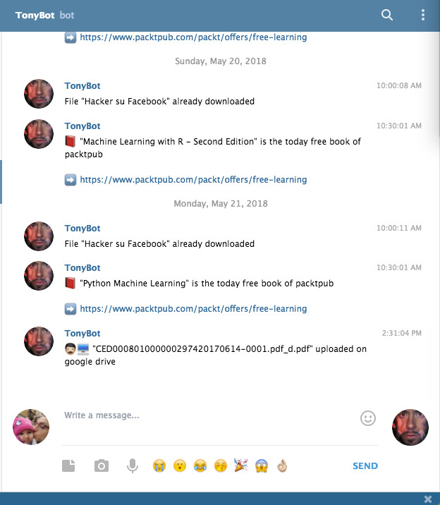

# tony
Tony is my virtual assistance? Maybe in a future... At the moment he do for me boring tasks and he tell to me what has made by telegram

## Feature
* Check on sprea.it if the last number of Linux Pro magazine is coming out, if present download the pdf and push it on my Google Drive
* Notify me every day the book offer PackPub Free Learning page 
* Pay Sheet - every day search into my work email and search content sent by HR team. If found email with attachments will decrypt pdfs and put them into my google drive

## Next Feature
* Oncall report - every month I need to send to HR the oncall time worked hours. This feature gets the hours worked from my google calendar and send an email to HR

## Screenshot

## Install 
WIP

## Deploy on RPI
~~~~
cd /opt
git clone
cd tony
docker build -t tony:0.0.1 -f Dockerfile-armv7l .
docker run -d -v /opt/tony/code:/tony -p 5000:5000 -t tony:0.0.1
~~~~
